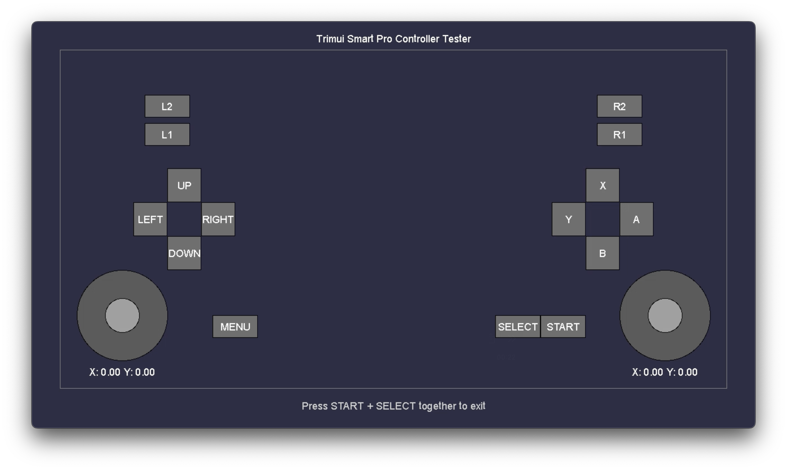

# Trimui Smart Pro Build System

A build system for creating applications for the Trimui Smart Pro. This build system provides a Dockerfile and a Makefile for building your application and necessary configuration files.

## Setup Instructions

### 1. Clone this repository

```bash
git clone https://github.com/Maxwell-SS/trimui-smart-pro-build-system.git
cd trimui-smart-pro-build-system
```

### 2. Build and run the Docker container
The Dockerfile will automatically download and extract all required SDK components from the official Trimui GitHub <a href="https://github.com/trimui/toolchain_sdk_smartpro/releases" target="_blank">repository</a> during the build process.
No manual downloading or setup is needed.

For macOS (Arm):
```bash
docker build --platform linux/amd64 -t trimui-sdk .
docker run -it --rm -v $(pwd):/app trimui-sdk bash
```

For Linux (Untested):
```bash
docker build -t trimui-sdk .
docker run -it --rm -v $(pwd):/app trimui-sdk bash
```

For Windows (PowerShell):
```powershell
docker build -t trimui-sdk .
docker run -it --rm -v ${PWD}:/app trimui-sdk bash
```

### 3. Build your application

Inside the Docker container:
```bash
make
```

### 4. Deploying to the Trimui Smart Pro

After building, the complete application will be in  `build/[APP_FOLDER]`. Copy the entire app folder to the `/SDCARD/Apps` folder on your Trimui Smart Pro.

## App Structure
```
build/[APP_FOLDER]/
├── Your_Compiled_App   # Your compiled app
├── icon.png            # Your app's icon
├── config.json         # App metadata
├── launch.sh           # Launch script
└── res/                # Resources
    └── arial.ttf       # App font
```

## Customizing Your Application

1. Edit the `APP_LABEL` and `APP_DESCRIPTION` variables in the Makefile
2. Replace the icon.png with your own app icon

## Controller Tester Application
The included `main.cpp` file is a controller testing app that allows you to visualize all the controller inputs for your device.

## License
Distributed under the MIT License. See `LICENSE` for more information.

